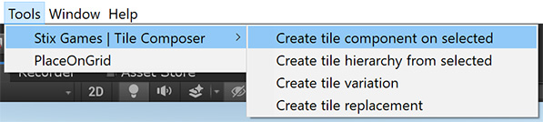

# Helpful Tools

The asset includes several helpful editor tools that make it easier to set up tile collections.

You can access them through the menu bar `Tools / Stix Games | Tile Composer`.&#x20;

<figure><figcaption></figcaption></figure>

## Create tile component on selected

This helper creates a tile component on each selected object.

## Create a tile hierarchy from selected

This helper treats the selected objects as a hierarchy of tiles, e.g. the parent will be the base tile and children will be tiles that inherit properties from it.

Additionally, the tool creates a parent object for each tile.

## Create tile variation

If you want to create a slight variation of a finished tile, use this helper, it will copy the selected tile and make the original the base tile of the parent.

## Create tile replacement

When using the `Auto-set neighbors from mesh` feature there can be situations where you want to make manual changes, but still want to be able to iterate the base mesh.

In this case you can create a tile replacement: Create a copy, make the original the base tile, then deaktivate the original. `Auto-set neighbors from mesh` will still use the disabled original, and your changes will not be overridden.
