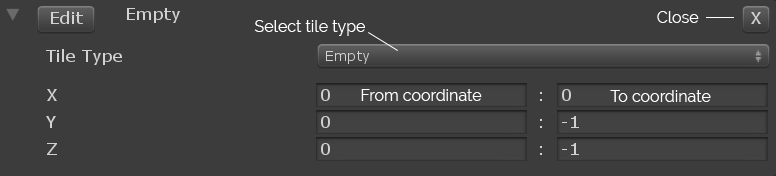

# Tile Composer

## Documentation: Tile Composer

The final piece for using the Tile Composer asset, is the name giving Tile Composer. This component takes a tile collection, either from the same scene or from a prefab, and generates a model from it.

### How to generate a model

The component immediately starts generating once it is activated in the scene, but you can also generate a model in the editor, by pressing the "Generate model in editor" button. Be aware that the editor doesn't support slow generation, if you want to debug your model, you should press play instead.

## General settings

Look at the tooltips for general information of all controls.

### Tile Collection

Select your tile collection here. The Tile Composer will try to create a model that follows all constraints you have set in your Tile Collection.

### Solver types

Creating a model from tiles is a very general problem (basically a SAT problem), so there can be multiple ways of solving it. The component lets you select between multiple solvers, which have different advantages and disadvantages. Look at the documentation page for [solvers ](solvers.md)for more information.

### Generate Asynchronously

This setting let's you generate the model in a separate thread. Be careful though, it is not supported to abort calculations, so even if you leave play mode, the thread will continue trying to generate the model and use performance.

## Grid Settings

### Grid size

This setting defines the size of the grid, where tiles will be placed. Be careful, larger grids will take longer to calculate, so always try to increase the size in small steps.

### Tile restrictions

* **Blocked Tiles**: Block a certain tile type on a grid position.
* **Fixed Tiles**: Block all tiles except this grid type (this overwrites blocked tiles)

Both settings work in the following way:

<figure><figcaption></figcaption></figure>

As you can see, in this example there are negative numbers. Those work like slices (for example in Python): If one of the numbers is negative, it will start at the end of the grid and walk backward. -1 represents the last grid position in that coordinate. This way you can easily define constraints that adapt to different grid sizes.


Be careful, using the scene view editor tools to change the selected area will remove negative numbers, so the slice will no longer scale with your grid.


## Solver specific settings

The solver settings let you change the inner workings of each solver and add additional constraints that may not be possible with other solvers.

Look at the documentation page for [solver](solvers.md) for more information.

## Debug Settings

These settings allow you to debug the generation process of some solvers (at the moment only Wave Function Collapse). Look at the tooltips for more information.
