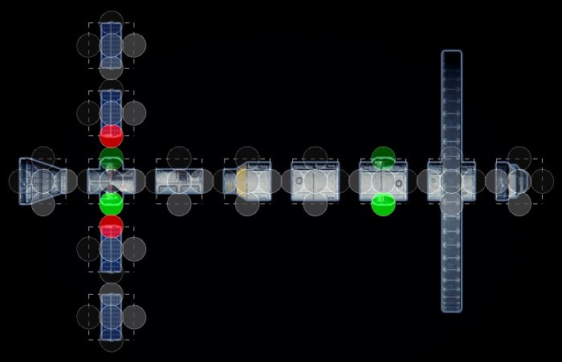

# Connectors

The connectors workflow is the last I developed, but in my opinion it is the easiest to used and most expressive workflow in most situations. The only situation when for example the [neighbors from mesh workflow](neighbors-from-mesh.md) would be better, is when you have a large amount of unique neighbors, so you would need a large amount of connectors, which could be hard to manage.

## 1. Tile set

In this tutorial I will define the connections for the spaceship example scene, here you can see the tileset:

<figure><figcaption></figcaption></figure>

I've already created a TileCollection component as parent for all tiles. Each of the tiles has to have the Tile component, you can use one of the [helper tools](../documentation/helpful-tools.md) to add batch add the tile component to all objects. The TileCollection uses a Box grid, but in this case it could have been a Rectangle grid instead, as the model always stays in one layer. You could easily extend it to create spaceships with 3d structures.

The ring tile isn't composed of multiple tiles, instead it is a single tile that goes beyond its tile size. Without additional constraints, the ring tiles can intersect with other parts of the spaceship. The second ring uses the first ring as base tile, the only difference is that it rotates in the opposite direction.

The only tile that will be rotated is the transition between thin maintenance and thick spaceship sections. We could also duplicate the tile and rotate it by 180°, that would also improve the performance of the Wave Function Collapse solver.

## 2. Empty tiles

We only need a single empty type, all outside areas of the spaceship are allowed to neighbor it, while the connection parts, where the spaceship will be connected to other spaceship tiles must not neighbor empty areas.

I'm using the Tile Collection Empty Assignment tool to change which sides may neighbor empty tiles.

<figure><figcaption>
To activate the empty assignment mode, press the assign button, right of the empty types name.
</figcaption></figure>

<figure><figcaption>
Then click all circles where you want the empty tile to be allowed. If the circle is green, it means that the tiles side may neighbor the empty tile.
</figcaption></figure>

## 3. Connectors

Next let's set up the connectors themselves. In the tile collection I've created 4 connectors. One each for the large and small connections between spaceship parts, I called them Main and Maintenance, both of them bidirectional. Next we need two directional connectors, I called them Utility and Solar panel.


Bidirectional means that the connector doesn't have a direction, all sides with this connector can be connected, at least if their rotation allows it. Directional connectors have in and out directions. Outgoing connectors can only be connected to ingoing connectors, connectors with the same type can't be connected. You can still add both In and Out to a tile side, which means it can be connected to all sides with the same connector type.


<figure><figcaption>
The final connector setup.
</figcaption></figure>

Next we have to assign connectors to the tiles. Once again, I'm using the Tile Collection assignment tool. Here are the final assignments:&#x20;


The color of each circle represents their status with the connector you're currently assigning. Yellow represents connections that are bidirectional, Green is In, Red is Out



Be careful, some of the circles are colored more transparent, because the editor doesn't recognize orthographic view at the time of writing this tutorial.


<figure><figcaption>
<strong>Main</strong>: All sides with a large spaceship opening.
</figcaption></figure>

<figure><figcaption>
<strong>Maintenance</strong>: All sides with a small spaceship opening.
</figcaption></figure>

<figure><figcaption>
<strong>Utility</strong>: We want solar panel sockets to only connect to the spaceship utility sockets, not to each other (which would lead to free floating solar panels), so we use an In connector for each utility port on the spaceship and an Out connector on each solar panels base plate. 
</figcaption></figure>

<figure><figcaption>
<strong>SolarPanel</strong>: Once again, we don't want free floating solar panels, to we use In and Out connectors to restrict their direction. Now solar panels can only connect to each other and have to be connected to a spaceship at their base.
</figcaption></figure>

## 4. Tile Composer

The last step is to set up the Tile Composer component. There are a few steps for this model:

* Add the tile collection to the Tile Composer component.
* Block the cockpit tile on the whole grid, we only want a single spaceship.
* Create a border of empty space around the model, otherwise we might get cut off spaceship parts at the border.
* Set a fixed position for a cockpit tile, this overrides the block.
* Optional: Select a seed with a good looking result (you can fine tune the weights of each tile to improve the results)

<figure><figcaption>
The final Tile Composer settings.
</figcaption></figure>

## 5. Result

<figure><figcaption>
One of the possible results.
</figcaption></figure>
