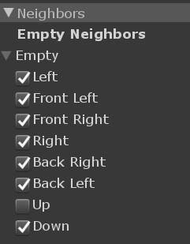
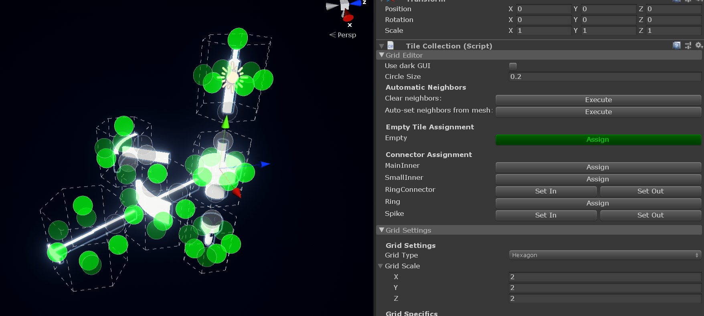
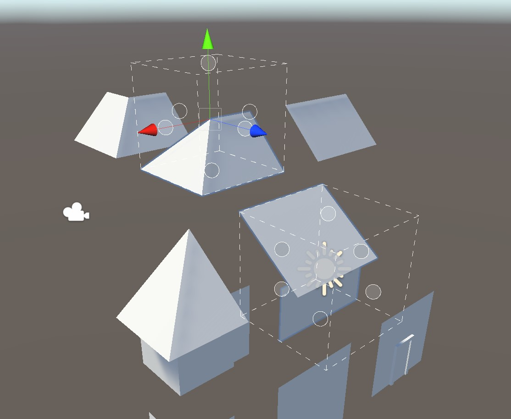

# Empty Tiles

It might be obvious that empty space is important for creating models. In Tile Composer this is even more true, as empty spaces shape the model itself.

Early during development, I noticed that a single empty type could be too restricting for some models, which is why Tile Composer supports adding as many empty types as necessary. In this short tutorial, I will explain what empty types are and how to use them to create a simple building tileset.

## Basics

First of all, empty tiles are not special in any way, they are regular tiles with some automatically added neighbor restrictions. The only real difference is that the Tile Composer component will leave an empty slot while creating the model, instead of instantiating a tile. Each empty tile can neighbor itself in all directions but is forbidden to neighbor any other empty type. You can either use the empty neighbors toggles on each tile or use the tile collection empty assignment tool to change which tile sides may neighbor an empty tile.

<figure><figcaption>
When you select a tile component, you can toggle which sides are allowed to neighbor an empty tile. 
</figcaption></figure>

<figure><figcaption>
Select the tile collection and you can use the empty tile assignment tool, to toggle which sides are allowed to neighbor each tile. Simply click on the circles to toggle if the empty is allowed there, or not. 
</figcaption></figure>

## Multiple empty tiles

Whenever you have empty spaces that will never touch each other, you should probably use multiple empty tiles. For example the inside and outside of a building, where the inside will never be visible. The constraint solvers will likely have an easier time if you have stronger restrictions, so differentiating between empty spaces could be a good start. Splitting empty spaces could make tile definitions in general much easier. However you should always try to make the neighbor restrictions as restrictive in possible, at least when using Wave Function Collapse, block as many tiles as possible, so the solver can reach a valid model as soon as possible. Read the [Wave Function Collapse documentation](../documentation/solvers.md#wave-function-collapse) for more information about optimizing tile collections for that solver.

***

Here's an example of a model that is only possible with an inside and outside tile type, at least not easily.

<figure><figcaption>
The tiles meet perfectly at the diagonal, so they technically don't neighbor each other. With an inside empty type this becomes quite easy. The top roof tiles neighbor <code>inside</code> on the bottom, the diagonal roof tiles neighbor <code>inside</code> on their inner side. The solver handles the rest.
</figcaption></figure>


The house example is included with the asset, in `Examples / Showcases / House`. Please be aware that this model is not optimized, it's merely a demonstration of using the inside type.

