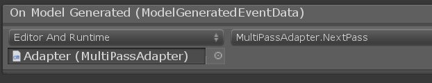

# Multiple Tile Composer Passes

When working with Tile Composer, it is often easier to create a Tile Collection that generates a simple model in the right shape, than getting the right shape with all visuals tiles. For example dungeon walls can have their own constraints, which reshape the room layouts.

In cases like this, you can create your model in multiple passes, for example:

* Create the room layout first, then using a complex tile set in the next step.
* Generate the basic shape of an island, then add rivers, decoration etc.
* First basic building shapes, then detailed tiles with complex rules.


You'll have to be careful that your first pass doesn't create restrictions that are impossible to solve with your second Tile Collection. When in doubt, switch the second solver to Z3, it can tell you if restrictions are impossible. It's quite quick at it too.


Here's how you can set up multiple passes:

1. Create two Tile Composers with two Tile Collections (You could also use the same one twice, but that probably doesn't make sense, unless you want to create a cellular automaton...)
2. Create a GameObject and add a Multi Pass Adapter component.
3. Select the tile collection of the first Tile Composer and the target Tile Composer
4. Add conversion rules. You can convert a tile type to multiple tile blocks or to a fixed tile.
5. Disable `Instantiate Model When Generate` on the Source Tile Composer.
6. Disable `Generate On Start` on the Target Tile Composer.
7.  Add the Multi Pass Adapter's `Next Pass` to the `On Model Generated` event on the source Tile Composer. Don't forget to change the event to `Editor and Runtime` if you want to generate the model in the editor. It should look like this:

    <figure><figcaption></figcaption></figure>
8. Finished! When you press `Generate model in editor` on the first Tile Composer or press Play, the second pass will automatically be triggered after the first one finishes.


You could also use multiple Source Tile Composers as long as they have the same Tile Collection (or Tile Collections with the same Tile Types).

