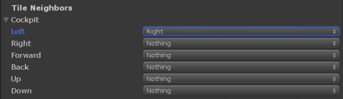
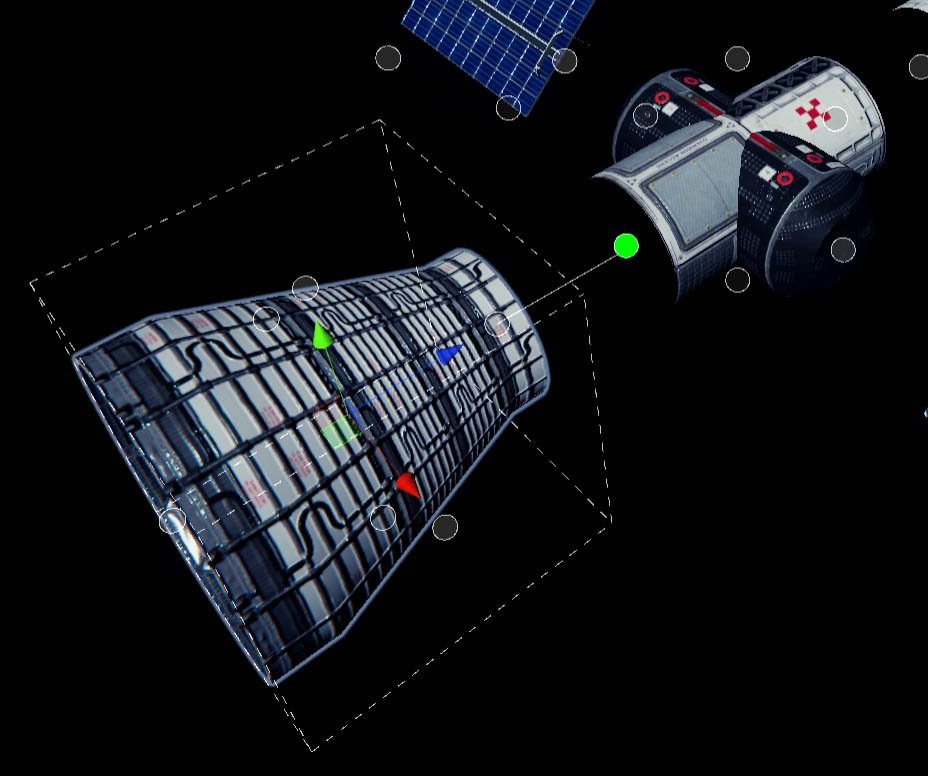

# Neighbor matrix editing

The most fine grained way of editing the tile neighbor matrix manually. In other words you take a tile and define which of it's sides may neighbor the side of another tile.

This is definitely the most work intensive way of working with Tile Composer, but there are some situation where it might be useful:

* Your tileset has many tiles that can only neighbor few other tile types, so you would need a huge amount of connectors.
* Creating a custom tool that automatically changes the neighbors

The neighbor matrix works has multiple layers:

1. The tile you are editing, each tile has a matrix of all other tile types
2. The target tile type, the next layers will decide if and where the two types may neighbor each other. This could be an empty type, but also the same tile type.
3. The side on the first tile: Can the target tile type neighbor our current tile _on this side_?
4. A selection of sides of the second tile: The selected sides may neighbor the current tiles side.


You have to select the sides on the neighbor tile, because it may be rotated in any direction. The neigbor matrix always uses the original rotation to check compatibility. Just select any sides that are allowed to neighbor each other and Tile Composer will handle the rest.


<figure><figcaption>
In this example the left side of the selected tile can neighbor the right side of the tile type "Cockpit".
</figcaption></figure>

## Use Connection Lines

In practice you should probably use the "Use Connection Lines" feature of the tile editor. When enabled, each side of you tile will have a circle. Click and drag this circle to the side of another tile and the connection will either be allowed or prevented.

<figure><figcaption>
The line between the two tiles connects the forward side of the engine with the back side of the crossing tile. The green circle shows that once the mouse is released, the two sides may connect each other. (The mouse was removed by the screenshot, it is in the green circle) 
</figcaption></figure>
