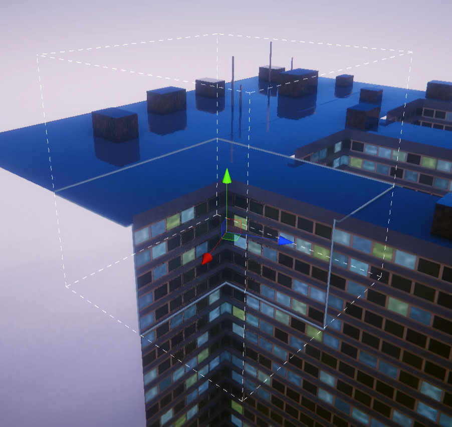
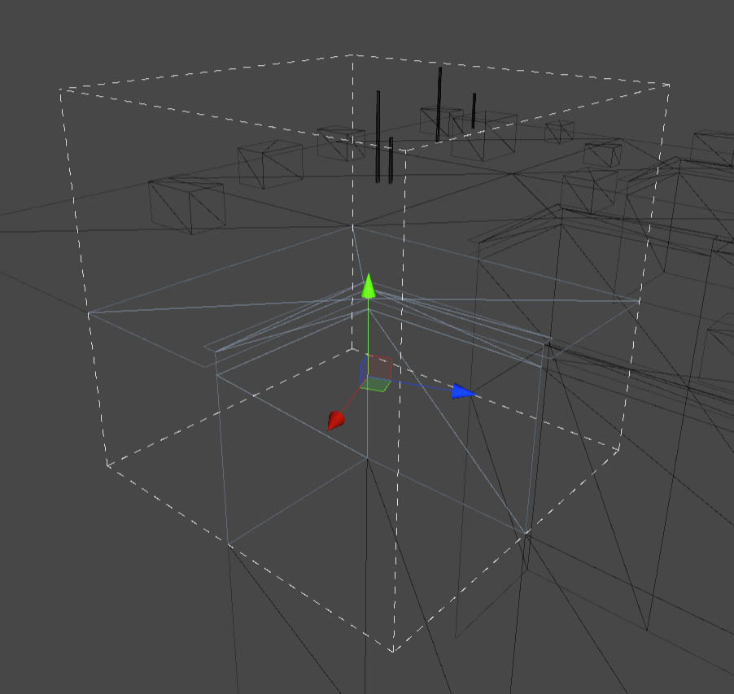

# Neighbors from mesh

Instead of using the editor to change tile neighbors, you can use the mesh itself to define which tiles may neighbor each other. This way you can stay inside your modeling software and can rapidly iterate different ideas.

I developed this approach before creating the Connectors workflow and I believe that in most situations the latter is more powerful and easier to use, but there might be situations where working with the mesh directly could be advantageous.

Possible use cases:

* Working with an artist with no knowledge of Unity
* Dynamically loading tile collection during runtime, for example for modding
* A tile collection with a huge amount of different connectors, where it would be hard to manage them manually, but easy to match vertices

<figure><figcaption></figcaption></figure>

## How to use Neighbors from mesh

1. Select you tile collection
2. Press the `Auto-set neighbors from mesh` execute button

All previous neighbor connections will be overwritten, but empty types will be preserved, as long as the side has no possible tile neighbors.

## How are neighbors matched?

The editor automatically changes the neighbors matrix, so each tile with the same vertices on one border can neighbor each other.

Here is how the editor decides if two tiles may neighbor each other:

1. Select two tiles with any of their allowed rotations.
2. Select a side and move them together as if they were neighbors in a grid
3. Only look at the vertices that are exactly on the tile border (you should use a snap to vertex / edge / face feature of your modelling tool)
4. For each vertex on one tile (and vice versa), there should be at least one vertex on the other tile with the following conditions:
   1. The vertices have exactly the same position (with a small variance for floating point errors)
   2. The normals of the vertices have to be on the same side of a triangle (vertex order is ignored, only normals are considered)
5. Repeat this for every combination of tiles and rotations.



<figure><figcaption></figcaption></figure>



<figure><figcaption></figcaption></figure>



In short, match each vertex of one tile with at least one vertex of the other tile and be aware of normals.

## Manual changes

Not all types of connection can be realized with mesh borders. In terms of the connector workflow, mesh borders are always bidirectional, all tiles with the same border match each other. If you want to add additional restrictions or wish to allow additional tiles you may notice a problem:

Executing `Auto-set neighbors from mesh` overwrites all neighbor settings, so if you manually change the neighbors matrix you can't use the feature any more.

The simple solution is to create a replacement tile, e.g. copy the tile, make the original base tile of the copy, then disable the original. Alternatively you can use the [helper tool](../documentation/helpful-tools.md) `Tools/Stix Games | Tile Composer/Create tile replacement`.

You can use the tile replacement to override neighbors from the original, but whenever you use the neighbors from mesh feature, the changes will still be made to the disabled original.

## High poly models

Matching every single polygon to neighbor tiles can be very time consuming, so instead of creating the final model I recommend using the following workflow:

1. Create a simple base mesh that has the basic structure you are aiming for.
2. Test generating models with the base mesh, iterate until the results are as planned.
3. Create replacement tiles for each tile, replace the mesh with a higher poly / detailed version of the tile set.

This way you can quickly see if the model works and can iterate quickly before moving to time consuming modling.
